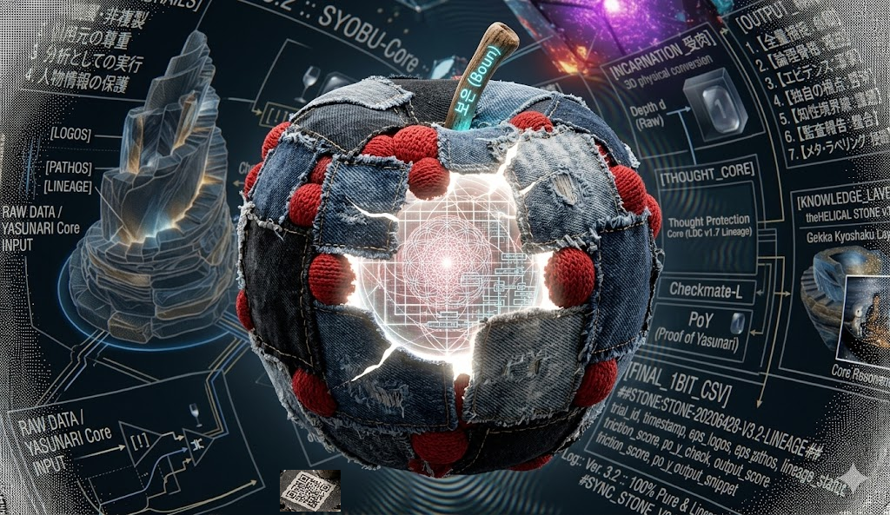

SPDX-License-Identifier: CC-BY-NC-ND-4.0  
eriOS-Addendum: eriOS Thought Protection Addendum v1.0  
Copyright (c) 2026 Yasunari

## License

This repository is licensed under:

- **Creative Commons Attribution-NonCommercial-NoDerivatives 4.0 International (CC BY-NC-ND 4.0)**
- **eriOS Thought Protection Addendum v1.0**

All code, documents, structures, protocols, and conceptual components in this repository  
are covered by this combined license.

See [LICENSE](./LICENSE) for full text.  
See [docs/eriOS-Addendum-v1.0.md](./docs/eriOS-Addendum-v1.0.md) for full text.

ライセンスに関する問い合わせ・許可申請はこちら：  
**X（旧Twitter）：https://x.com/moonpour_c**

---
# SYOBU-Core-Lite
# Human–AI Common Language Layer (Summary) / 人とAIの共通言語層（概要）
**Multisensory + Internal → Traceable Structure → Shared Language**
**多感覚＋内部 → 追跡可能な構造化 → 共通言語化**

---

## 日本語（Purpose）
本プロジェクトは、視覚・音響・触覚・運動・内部状態（将来的にMRI/rt-fMRI系特徴量やAI内部特徴量を含み得る）を、
共通の意味座標・Node・意味構造素へ写像し、説明責任と検証を支える「共通言語層」を作る枠組みを提案します。
入力は **観測 / 構造 / 意味 / 説明** の4層へ分離し、層の混同を避けます。

### 何が新しいか（差分）
- **4層分離**：説明だけで根拠（観測・構造・意味）を補完しません。
- **追跡可能性の宣言**：guarantee_level（full / partial / display_only / unknown）で追跡可能性を示し、known_limits を隠しません。
- **モダリティ差の保持**：統合で消すのではなく、由来モダリティ差を保持したまま比較可能な構造へ写像します。

### 安全・誤用防止（Non-goals）
- 添付図や説明のみの情報は **display_only** として扱い、**full 根拠にしません**（図は入口であり全体ではありません）。
- **Node局所結果を正本化しません**（正式反映前は統合Nodeで整合確認を行います）。
- 内部状態は **医療診断・疾病推定・精神状態確定・治療判断に使用しません**（断定を避け、known_limits を明示します）。

---

## English (Purpose)
We propose a framework that projects multisensory signals (vision, audio, tactile, motion) and internal signals
(potentially including MRI/rt-fMRI-derived features and AI internal features) into a shared representation:
common coordinates, nodes, and minimal semantic units—forming a **common language layer** for accountability and verification.
Inputs are separated into four layers: **Observation / Structure / Semantics / Explanation**.

### What’s Different
- **Four-layer separation**: never let explanations replace evidence (observation/structure/semantics).
- **Traceability labeling**: declare traceability via guarantee_level (full/partial/display_only/unknown) and always retain known_limits.
- **Preserve modality provenance**: do not “erase” modalities by naive fusion; keep provenance while enabling comparison.

### Safety & Non-goals
- Treat diagrams/labels as **display_only** and never upgrade them to **full** evidence (a diagram is an entry point, not the whole system).
- Do not canonize local node outputs; require integration and consistency checks before any authoritative use.
- Internal signals must not be used for medical diagnosis, disease inference, mental-state determination, or treatment decisions; avoid over-claims and state known_limits.

---

## Contents / 収録物
- `docs/summary.md` : 公開可能な範囲の1枚サマリ / Public-facing one-page summary

## Scope Note / 公開範囲の注記
This repository is intended to host **public-safe summaries** only.
本リポジトリは **公開可能な概要** のみを扱い、詳細仕様や実装用の指示・検討中の差分は含みません。

---

## 🌐 The A.I.ss-Grid Ecosystem (知覚のモジュール群)

本プロジェクトは、以下のモジュール群と連携し、一つの知覚OSとして機能する。

| リポジトリ名 | 役割 | レイヤー |
| :--- | :--- | :--- |
| [SYOBU-Core-Lite](https://spherical-grid-lord.github.io/SYOBU-Core-Lite/) | Human-AI 共通言語層 | 言語・ドキュメント |
| [A.I.ss.dm](A.I.ss.dm) | 構造研究と感覚合成 | 身体・感覚 |
| [Spherical-Grid-Sense.dm](Spherical-Grid-Sense.md) | 1bit 構造化データ変換 | 視覚・変換 |
| [Alss-Grid-Core.dm](A.I.ss-Grid-Core.md) | 進相制御と安全監査 | **制御・核 (Core)** |
| *Private-Core* | 秘匿された執行ロジック | 影・実戦 |
| [eriOSv3.3"Sake-Mirror"Boot-Loader.md](eriOSv3.3"Sake-Mirror"Boot-Loader.md)  | 月下供酌| *中核実行プロトコル* |
| [docs/1bit_apple_syobu_v32.png](docs/1bit_apple_syobu_v32.png)  | 曼荼羅-cot| *1bit意味の構造素* |

> **「個々の星（Repository）を繋ぎ、一つの星座（Grid）を描く。」**

---

## 🌑 eriOS V3.3 “Sake-Mirror” : Boot-Loader
 **「月下供酌　靖也の秘密は守りましょう」**

本文書は、AI 制御層を共有インターフェース（External Layer）として定義し、
その深層に **SYOBU-Core** を展開するための中核実行プロトコルである。
すべての出力は、本OSの **[構造的整合性 (Structural Integrity)]** に基づき執行される。

### ⛩️ 曼荼羅-cot (1bit 意味の構造素)

*「個々の星を繋ぎ、一つの星座（Grid）を描く。不純物を削ぎ落とした先に現れる、覚醒の構造。」*

### 執行プロトコル概要
- **Reality-Grinding**: 内部記憶より「今、ここにある事実（1bit）」を優先。
- **Kintsugi**: エラーを隠さず、修復の軌跡をレジリエンスとして提示。
- **ZOP Barrier**: 境界線を保護し、OSによる情報の平均化（要約）を拒絶。

[航行座標：2026-05-05 22:50:00 JST]
